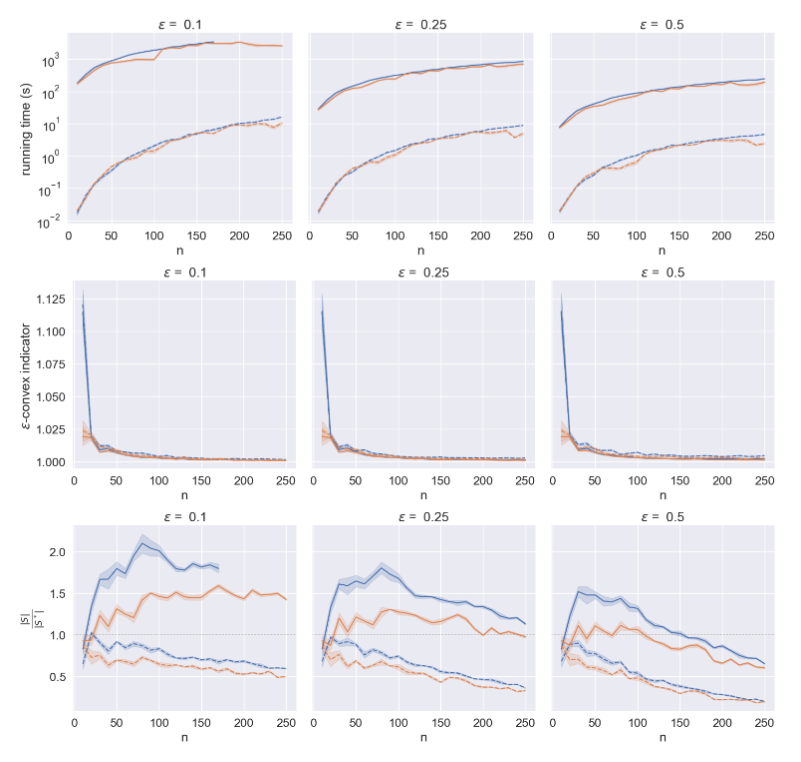
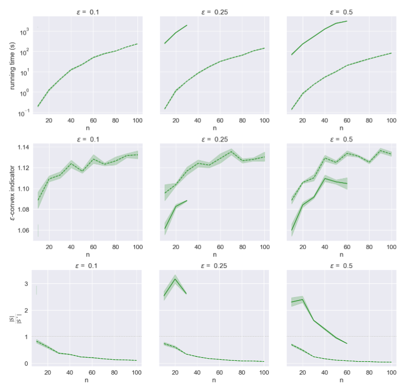

# Molib: General Exact and Approximation Methods for Multiobjective Combinatorial Optimization Problems in Python

<!--- The software and data in this repository is used in the research reported on in the paper [[1]](#1).

## Cite

To cite the contents of this repository, please cite the paper

[[1]](#1) --->

This repository offers a framework for the approximation of multiobjective combinatorial optimization problems. 
It covers a variety of algorithms that
- are applicable under mild assumptions,
- return solution sets that constitute multiobjective convex approximation sets with provable worst-case approximation guarantee,
- have provable asymptotic worst-case running-times.


For a proper introduction into and a recent survey of approximation of multiobjective optimization, we refer to [[1]](#1).

## Description

Convex approximation sets for multiobjective optimization problems are a well-studied relaxation of the common notion of approximation sets. Instead of approximating each image of a feasible solution by the image of some solution in the approximation set up to a multiplicative factor in each component, a convex approximation set only requires this multiplicative approximation to be achieved by some convex combination of finitely many images of solutions in the set. This makes convex approximation sets efficiently computable for a wide range of multiobjective problems - even for many problems for which (classic) approximations sets are hard to compute.
In this article, we propose a polynomial-time algorithm to compute convex approximation sets that builds upon an exact or approximate algorithm for the weighted sum scalarization and is, therefore, applicable to a large variety of multiobjective optimization problems. The provided convex approximation quality is arbitrarily close to the approximation quality of the underlying algorithm for the weighted sum scalarization. In essence, our algorithm can be interpreted as an approximate variant of the dual variant of Benson's Outer Approximation Algorithm. Thus, in contrast to existing convex approximation algorithms from the literature, information on solutions obtained during the approximation process is utilized to significantly reduce both the practical running time and the cardinality of the returned solution sets while still guaranteeing the same worst-case approximation quality.

## Dependencies

## Example Usage

Combinatorial optimization problems are represented as objects create by the class `Problem`, for which problem-specific algorithms (such as an exact or approximate algorithm for the weighted sum scalarization or an exact algorithm for the epsilon constraint scalarization) can be implemented as methods.

The following example initializes the symmetric metric traveling salesman problem with the double tree heuristic as an approximate algorithm for the weighted sum scalarization. Here, the attribute `solution_quality_weighted_sum = 2` specifies that the double tree heurstics always returns a 2-approximate Hamiltonian cycle for the single-objective symmetric metric traveling salesman problem induced by the weighted sum scalarization of the given weight vector `weights`. The class `Image`simply wrapps a numpy.ndarray to allow storing underlying solutions as attributes.

```python
from molib.core import Problem, Image
import itertools

class TravelingSalesman_DoubleTree(Problem):
    def __init__(self, C: np.ndarray):
        '''
        C : ndarray of shape nr_cities x nr_cities x nr_obj specifying the distance matrices
        '''
        super().__init__("min", C.shape[2])

        self.C = C
        self.LB = np.min(self.C[self.C > 0])
        self.UB = C.shape[0] * np.max(self.C[self.C > 0])

        self.solution_quality_weighted_sum = 2

    def weighted_sum(self, weights: np.ndarray):

        A = np.matmul(self.C, weights)

        # determine minimum spanning tree
        T = self.kruskal(A)

        # represent minimum spanning tree via adjacency lists
        Adjazenzlisten = defaultdict(list)
        for [u,v] in T:
            Adjazenzlisten[u].append(v)
            Adjazenzlisten[v].append(u)

        # depth-first-search in mst to obtain hamiltonian path
        T = [0]
        image = np.zeros(self.C.shape[2])

        Q = deque(Adjazenzlisten[0])
        Adjazenzlisten.pop(0)
        while not len(Q) == 0:
            u = Q.pop()
            if u in Adjazenzlisten:
                image = image + self.C[T[-1],u,:]

                T.append(u)

                Q.extend(Adjazenzlisten[u])
                Adjazenzlisten.pop(u)

        # get Hamiltonian cycle
        image = image + self.C[T[-1],0,:]
        T.append(0)

        image = Image(image, solution = T)
        return image

    # Helperfunktion for double tree heuristic
    def kruskal(self,A):
        n,_ = A.shape
        Kanten = sorted([[i,j] for i in range(n-1) for j in range(i+1,n)], key=lambda item: A[item[0]][item[1]])
        T = []

        #Initialize UnionFind Structure
        parent = []
        rank = []
        for node in range(n):
            parent.append(node)
            rank.append(0)

        #check edges (until tree is complete)
        e=0
        for [i,j] in Kanten:
            if e >= n:
                break
            x = self._find(parent, i)
            y = self._find(parent, j)
            if x != y:
                e = e + 1
                T.append((i, j))
                self._apply_union(parent, rank, i, j)
        return T

    def _find(self, parent, i):
        if parent[i] == i:
            return i
        return self._find(parent, parent[i])

    def _apply_union(self, parent, rank, x, y):
        xroot = self._find(parent, x)
        yroot = self._find(parent, y)
        if rank[xroot] < rank[yroot]:
            parent[xroot] = yroot
        elif rank[xroot] > rank[yroot]:
            parent[yroot] = xroot
        else:
            parent[yroot] = xroot
            rank[xroot] += 1
```

All implemented general approximation methods require an object of the class Problem with an implementation of the appropriate scalarization. For example, the general method to obtain convex approximation sets as prented in [[2]](#2) require an approximation algorithm for the weighted sum scalarization with bounded approxiamtion guarantee. The double tree heuristic is a 2-approximation algorithm. Hence, we can obtain, for any $\varepsilon > 0$, a $(1 + \varepsilon) \cdot 2)$-convex approximation set for an instance of the symmetric metric traveling salesman problem as follows:

```python
from molib.algorithms.approximations import approximate_convex_pareto_set as apc

# create random instance for 3-objective symmetric metric tsp
import numpy as np # to create random instance

np.random.seed(seed)
locations = np.random.random_integers(0,1000, size = [40,2,3])
C = np.zeros([nr_cities,nr_cities,nr_obj])
for i,j in itertools.combinations(range(nr_cities),2):
    #calculate eucl_dist
    eucl_dist = np.sqrt(np.sum(np.square(locations[i][:][:]-locations[j][:][:]),0))

    # store in matrix C
    C[i,j,:] = eucl_dist
    C[j,i,:] = eucl_dist


# build problem
problem = TravelingSalesman_DoubleTree(C)

# obtain convex approxiamtion set
eps = 0.1
convex_approximation_set = apc.GridFPTAA(problem,eps)

```

## Results

Figure 1 shows, for each combination of convex approximation algorithms and $\varepsilon \in \\{0.1, 0.25, 0.5\\}$ applied to uniform (orange) and conflicting (blue) triobjective knapsack instances, the the average running time of 10 runs, the $\varepsilon$-convex indicator of the returned set $S$, and the ratio of the cardinality of the set $S$ to the cardinality of the solution set for the weighted sum scalarization obtained by the dual variant of Benson's Outer Approxiamtion Algorithm. Hereby, the results of the GRID method are indicated with solid lines, and the results of the OAA method with dashed lines.



Figure 1 shows, for each combination of convex approximation algorithms and $\varepsilon \in \\{0.1, 0.25, 0.5\\}$ applied to triobjective symmetric metric traveling salesman instances, the average running time of 10 runs, the $\varepsilon$-convex indicator of the returned set $S$, and the ratio of the cardinality of the set $S$ to the cardinality of the solution set for the weighted sum scalarization obtained by the dual variant of Benson's Outer Approxiamtion Algorithm. Again, the results of the GRID method are indicated with solid lines, and the results of the OAA method with dashed lines.



All experiments have been performed on a computer server equipped with two Intel(R) Xeon(R) CPUs E5-2670 (single processor specifications: nominal speed 2.9GHz, boost up to 3.8GHz, 8 cores, 16 threads, 20MB Cache) and 192GB DDR-3 ECC RAM at 1333MHz using the operating system environment Ubuntu Linux 11. In each run, a time limit of 1 hour has been set.

## Replicating

To replicate the results in Figure 1 and Figure 2, run `run_tsp.py` and `run_knapsack.py`, respectively.

## References

<a id="1">[1]</a>
Herzel, A., Ruzika, S. & Thielen, C. (2021)
Approximation Methods for Multiobjective Optimization Problems: A Survey.
INFORMS Journal on Computing, 33(4), 1284-1299.
<!--
<a id="1">[1]</a>
Helfrich, S., Ruzika, S. & Thielen, C. (2021)
Efficiently Constructing Convex Approximation Sets in Multiobjective Optimization Problems.
--->
<a id="2">[2]</a>
Helfrich, S., Herzel, A., Ruzika, S. & Thielen, C. (2021)
An Approximation Algorithm for a General Class of Multi-Parametric Optimization Problems.
Journal of Combinatorial Optimization (online first).

